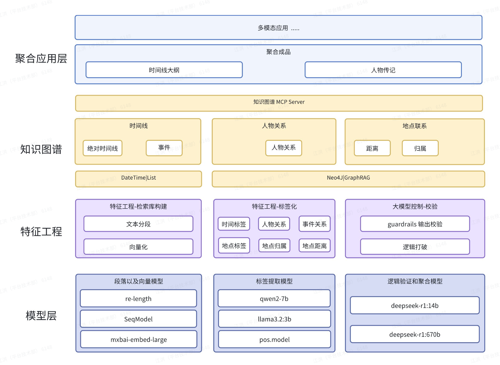

# AI-NOVEL-Story

### 背景
1. 本身喜欢看历史，很多历史资料采用传记，编年史的格式
《后汉书·诸葛亮传》，并且很多历史资料存在差异需要交叉
散
，需要研
究者使用大量的时间去整理分析。
2. 垃圾《凡人修仙传》追了几年回头看过去好家伙 746万字
云一下，了解脉络。
来梳理，比如《三国志》、《曹瞒传》、
验证，但是文学资料往往非常的分
了这不是要命了，有没有什么办法快速
3. 很喜欢看 UP 主对小说人物志的总结分析，但是很多克苏鲁的小说，《永不止息》，《从红月开
始》相关的人物志都没有人
在做。
### 使用经典的 RAG 框架面对的问题
1. 时间线大纲需要对大量的文本进行分析，几百万字的文章作品很难直接使用大模型分析
2.大模型的幻觉严重，没有有效的办法对大模型的输出做控制（特别是对我也不熟悉的领域）。
3. 在线大模型的价格非常贵，特别是输入
Token。

### 软件架构

1. Seqmodel
Sequence Model with Self-Adaztive Sliding Window for Efficient Spoken DocumentSegmentation
自动预测口语文档的段落分割可以同时提高可读性和下游 NLP 性能，如摘要和机器阅读理解。我们
提出了一种具有自适应滑动窗口的序列模型，用于准确高效的段落分割。
• SeqModel利用BERT对多个句子同时编码，建模了更长的上下文之间依赖关系之后再计算句向量，最后预测每个句子后边是否进行文本分割
• 此外，该模型还使用了自适应滑动窗口方法，在在不牺牲准确性的情况下进一步加快推理速度
• https://arxiv.org/bas/2107.09278

2. guardrails
Guardrails 是一个 Python 框架，通过执行两个关键功能帮助构建可靠的 AI 应用程序：
• 使用 Guardrails 从LLMs生成结构化数据
•创建输入和输出防护措施以验证LLM
• https://github.com/guardrails-ai/guardrails

3. pos.model
哈工大开源的中文词性分析模型，用于地区，人名、地名

4. 逻辑打破
打断 AI 的逻辑链条重新推理，是否可以推理出一致的结果
• 基于 Guardrails 的结构化限制，打断 AI 的逻辑链尝试重新推理是否可以得到原来的结果

### 标准化时间线
> 特征工程阶段总结来说就是从文本中把非结构化的数据转换结构化的数据，并以标签的格式处理在各个文本段落上，从而为构建结构化知识图谱提供有效数据基础。

#### 1. 时间特征有大量的相对时间
韩伙计和崔本去送三万盐引
>如《金瓶梅》中有：二年3月初4，只五日就赶到京中,咱旧时和乔亲家爹，高阳关上纳的那三万粮仓钞，派三万盐引。
恰逢户部坐派为老公公庆生。

推断出老公公 三月初 9 生日
>不想 前日老公公生日，他娘子儿到东京只一说，老公公恼了，将这几个人的名字送与朱太尉，朱太
尉批行东平府，着落本县拿人。 昨日 把老孙、祝麻子与小张闲都从李桂儿家拿的去了。李桂儿便躲
在隔壁朱毛头家过了一夜。今日说来央及你来了。

3月初九老公公生日来推断出老孙、祝麻子与小张闲在 3月初10被抓。

#### 对于相对标签问题采用多轮次的推断处理
1. 1轮迭代事件
- 老公公生日
- - 时间：
- - 地点：
- - 人物：老公公
- - 事件：生日
- - 原因：生日
2. 2 轮迭代
- 老公公生日
- - 时间：三万盐引送达京中
- - 地点：京中
- - 人物：老公公
- - 事件：生日
- - 原因：生日
3. 3轮迭代
- 老公公生日
- - 时间：二年3月初9
- - 地点：京中
- - 人物：老公公
- - 事件：生日
- - 原因：生日

### 推断冲突如何处理
>门庆因坟上新盖了山子卷棚房屋，二年三月初六日 清明，
- 标签事件 1：二年三月初六日西门庆 新盖了山子卷棚房屋 宴请了张团练、乔大户、吴大舅、吴二舅、花大舅、沈姨夫、应伯爵、谢希大、傅伙计、韩道国、云理守韩道国铺子里上宿，没来家，老婆买了许多东西，叫老冯厨下整治。
- 标签事件2：二年三月初六日 韩道国于铺子里上宿
存在推理冲突

在冲突则会重新使用推理模型对冲突标签做重建，对目标段落重新创建标签。
后面发现 `二年三月初六日` 西门庆只是发了请帖而已。

### NLP 工具集合
